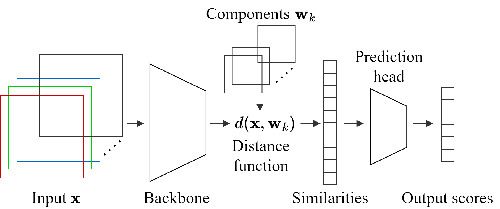
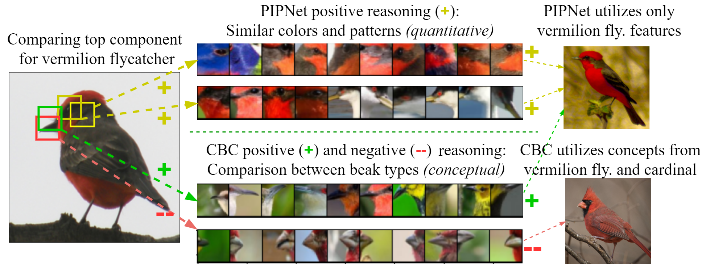

## Deep CBC Models for Prototype Based Interpretability Benchmarks

This repository contains the implementation for the deep experiments in the paper
["A Robust Prototype-Based Network with Interpretable RBF
Classifier Foundations"](https://arxiv.org/abs/2412.15499) _(AAAI 2025)_.

<div align="center">
    
</div>

The package `deep_cbc` executes the Classification-by-Components (CBC) deep models
for the prototype-based models on interpretability benchmarks.

CBC approach probabilistically improves the interpretability of Prototype-based Networks (PBNs).
LeNet5 is the first deep PBN where an RBF head is used to measure the similarity between inputs
and the so-called "model" (prototypes) of classes. Starting from ProtoPNet, almost all
existing architectures build on each other and use RBF-based prediction heads with some
constraints or regularizers.
Using this relation, we explain why PBNs can be used for outlier detection and why they
can face interpretability  difficulties. With our proposed CBC approach, we overcome these
difficulties and show that negative reasoning helps to learn performant models.

<div align="center">
    
</div>

We also present our arguments that not using negative reasoning in deep PBNs is a missed
opportunity to build better PBNs. Since, cognitively we make inferences in our daily lives
even when attributes are absent. So, our machine learning approaches should do the same.
Our CBC approach encourages us to learn conceptual components
whose presence and absence create evidence for the target class.
The CBC approach achieves SotA results by using negative reasoning.

Currently, `deep_cbc` supports execution and reporting of interpretability metrics
and result visualizations for `CUB`, `PETS` and `CARS` datasets for CBCNet,
RBFNet _(CBCs with positive reasoning)_ and PIPNet networks.

`Note:` The additional shallow model experiments will be made available through a separate
code repository. And the url of that repository will soon be updated here. Further, the model
checkpoints will be made available through a separated url as well which will be updated here soon.

### Setting up the Project

The project structure setup instructions for the `deep_cbc` package are stated
below as reference:

1.  Create a virtual environment for executing your code within that
    environment with the command `python -m venv deep_cbc_env`.
2. Install `poetry` so that you can install all the prerequisite dependencies
   for the project with the command `pip install poetry`.
3. In case you are interested in directly using the `deep_cbc` package then run the command
   `poetry install` in the package directory. Otherwise, for package editing and
   codebase changes for experimentation, execute the command `pip install -e .` for
   your development work.

We implemented our code base with Python 3.9.19 and CUDA version 12.1. But, feel free to
use updated settings based on your requirements. Additionally, for diagnosing any
dependency issues we have also made a `pip freeze` snapshot of all dependencies available in the
`requirements.txt` file present in the `assets` directory.

Now the project structure is ready for executing the further experiments for the
deep prototype-based networks.

### Setting up the Benchmark Datasets

The general structure for the benchmark datasets is stated below. It is needed
that any given interpretability dataset follows the below structure for model training.

```
- data
  - dataset_one_name
    - train
      - class_a
        - image_a_1.jpg/png
        - image_a_2.jpg/png
        ...
      - class_b
        - image_b_1.jpg/png
        - image_b_2.jpg/png
        ...
    - test
      - class_a
        - image_a_1.jpg/png
        - image_a_2.jpg/png
        ...
      - class_b
        - image_b_1.jpg/png
        - image_b_2.jpg/png
        ...
  - dataset_two_name
    ...
```

The publicly available `CARS` dataset is already present in the given
format. Possibly, data preprocessing can be done to make the images standardized
in their dimensions. In our experiments, we didn't implement this image size
standardization.

Second, the respective data preprocessing functions for the `CUB` and `PETS` are
present in the `deep_cbc.utils.preprocess` submodule for execution. Based on
these preprocessing functions you can build preprocessing scripts for your
own dataset as well.

The submodule `deep_cbc.utils.data` defines the data loader functions for the
interpretability benchmark datasets. And these functions can be used as
reference to build your own custom dataset data loaders.

### Model Inventory Availability

So, for each of the respective three benchmark datasets
_(`CUB`, `PETS` and `CARS`)_, we will have pre-trained and end-to-end classification
task trained models with RBFNet, CBCNet with ConvNeXt backbone,
CBCNet with ResNet50 fully-trained backbone and CBCNet with ResNet50 partially-trained backbone
architectures.

So, each dataset has four variations in architecture available
for evaluation and analysis.
Further, the model checkpoints will be made available through a separated url
as well which will be updated here soon.

`Note:` For other reported deep prototype based networks in the paper,
we used either the respective available model checkpoints
or code base repository training script executions to get the
reported evaluation metrics and carry out our interpretability analysis.

### Understanding and Executing the `deep_cbc` Package

We will provide two different execution approaches to execute training
and evaluation scripts.

1. The `executor_scripts` directory consists of bash scripts that
  can be used to execute the given architectures on different datasets.
  Further, the only required step is to change the configuration name
  and path based on the requirements. The configuration files are present
  in the `deep_cbc.configs` submodule and are loaded through the `ModelConfig` data
  class through `hydra` framework.

`Note: ` We can also directly load the config without using the `ModelConfig` data
class with decorator below. But, this design is opted for more standardization
in the different experiment implementation executions.

```
@hydra.main(version_base=None, config_path="<config_directory_path>", config_name="config_name.yaml")
```

Also, using `hydra` is a design choice used by us for logging our experiments. And its usage can
be omitted as well by directly loading the given `yaml` config file into your execution script.

2. The individual executors of CBCNet and PIPNet models are provided with
  `cbcnet_executor.py` and `pipnet_executor.py` scripts. These executors
  load all the parameters from the specified configuration files in the
  `deep_cbc.configs` submodule. Additionally, these executor files can be
  used to execute models with any specific configurations.

`Note: ` For earlier PIPNet [code base](https://github.com/M-Nauta/PIPNet) compatibility, a simple command line
arguments based script is also provided with `pipnet_main.py`. Also, the
descriptions of the arguments or hyperparameters in the configuration file
are provided in the `get_args()` function present in `deep_cbc.utils.args` submodule.

Further, for getting more details about the generated log files, visualizations
and other metadata refer to the `README.md` from the PIPNet [code base](https://github.com/M-Nauta/PIPNet).

Additionally, the above executor and main scripts can also be used just
to load the already trained checkpoints and create the visualizations.
This would require the training epochs related parameters to be set to zero and
visualization flag to be activated.

Further, the RBFNetwork implementation is just an earlier PIPNet implementation
where the last ReLU layer is replaced with the Softmax layer. And, it becomes
equivalent to the CBC with only positive reasoning, but the training for this
implementation becomes more unstable as the number of classes increases.

Finally, the CBCNet related scripts alone can be used to execute and replicate all model results, like
from CBCNet, RBFNet and PIPNet with all the interpretability datasets, provided the configuration file
hyperparameters are correct one. The PIPNet implementation is provided as a useful reference
to people who are already familiar with PIPNet or ProtoPNet repositories. And draw direct
parallels with the RBFNet in deep neural architecture settings as well.

The hydra framework is helpful in preparing additional experiment logs
based on the execution timestamps which is helpful in keeping track and backup
of the configuration files corresponding to given experiments.

### Acknowledgements

This repository consists of some function implementations taken from the PIPNet and
ProtoPNet repositories. We thank the authors for their contribution.

### Citation

If you find this work helpful in your research, please also consider citing:

```bibtex
@article{saralajew2024robust,
  title={A Robust Prototype-Based Network with Interpretable RBF Classifier Foundations},
  author={Saralajew, Sascha and Rana, Ashish and Villmann, Thomas and Shaker, Ammar},
  journal={arXiv preprint arXiv:2412.15499},
  year={2024}
}
```
